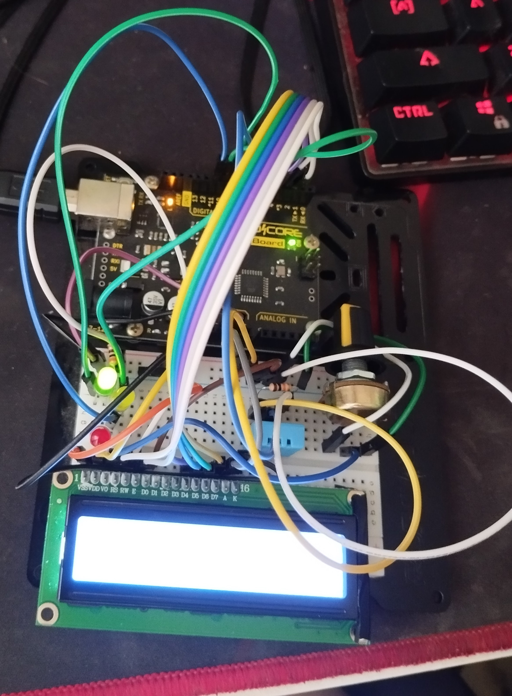
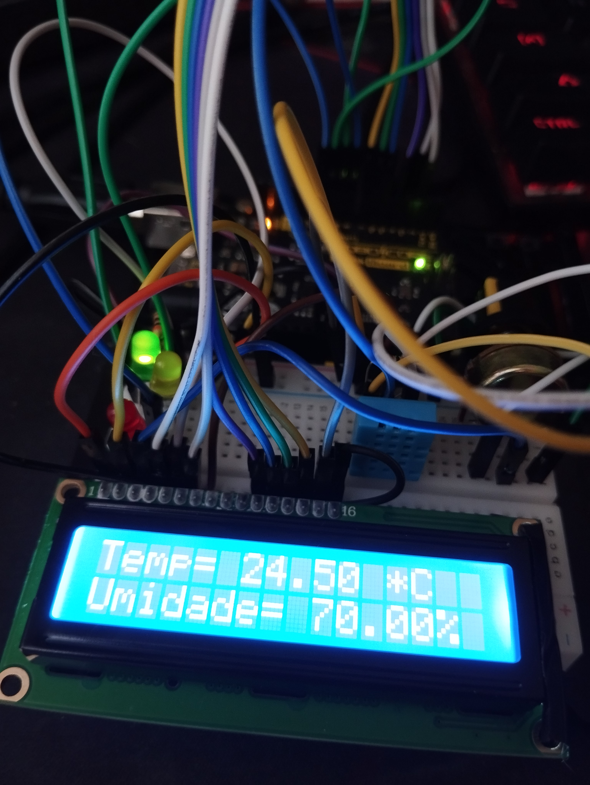

# TempAndHumidityMonitor
Description:
This script reads temperature and humidity from a DHT11 sensor and displays the results on a 16-pin LCD screen. The code also controls three LEDs (green, yellow, and red) based on updated humidity thresholds.

Components:
DHT11 Sensor for temperature and humidity
16x2 LCD screen for display
Green, yellow, and red LEDs for humidity indication.

Pin Configurations:
DHT sensor connected to pin 8
LCD screen connected to pins 3, 2, 4, 5, 6, 7
Green LED on pin 9, Yellow LED on pin 10, Red LED on pin 11

Functionality:
Initializes the LCD screen and DHT sensor in the setup.
Monitors temperature and humidity in the loop.
Controls LEDs based on updated humidity levels:
Green LED: Humidity >= 50%
Yellow LED: 16% <= Humidity <= 49%
Red LED: Humidity <= 15%
Displays temperature and humidity on the serial monitor.
Prints temperature and humidity on the LCD screen.
Clears the LCD screen after a delay of 3000 milliseconds.

Notes:
Serial communication (9600 baud) for monitoring on the serial monitor.
Adjusted LED threshold values for improved humidity indication.

Why?:
I created this script firstly for my health, where i live the humidity tend to vary a lot, and i have respiratory problems that could benefit from this monitoring, when the yellow light is on, i turn on my umidifier so the humidity goes back to the acceptable, around 55%.

# Tinkercad link: https://www.tinkercad.com/things/l56GOqPI32H-tempandhumiditymonitor

# Images of the project

